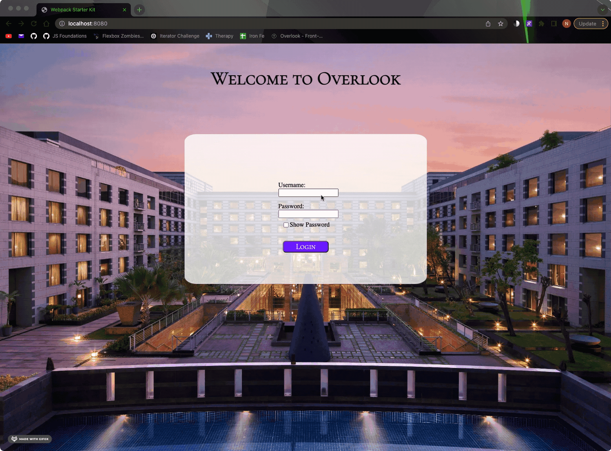
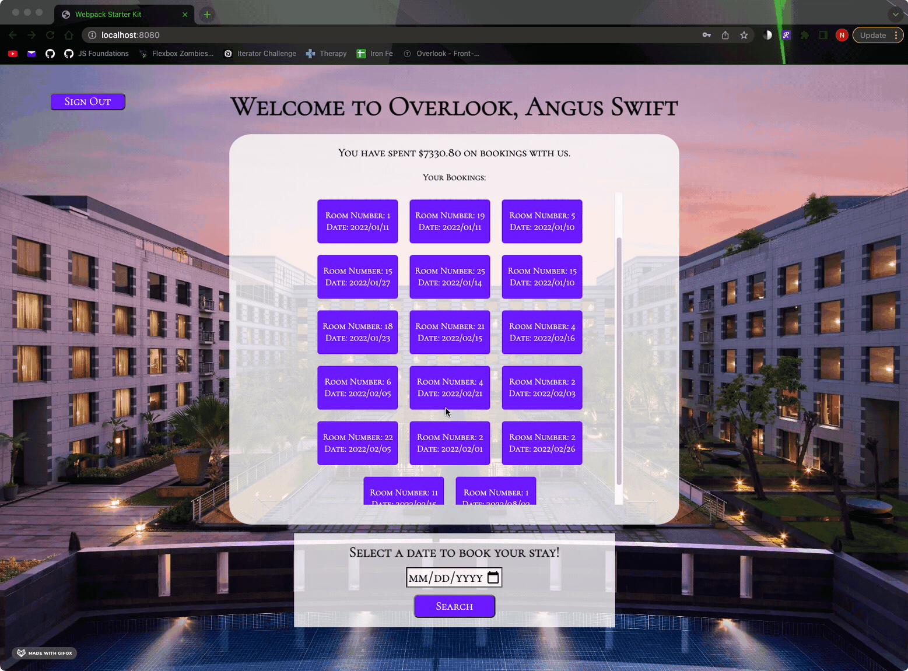
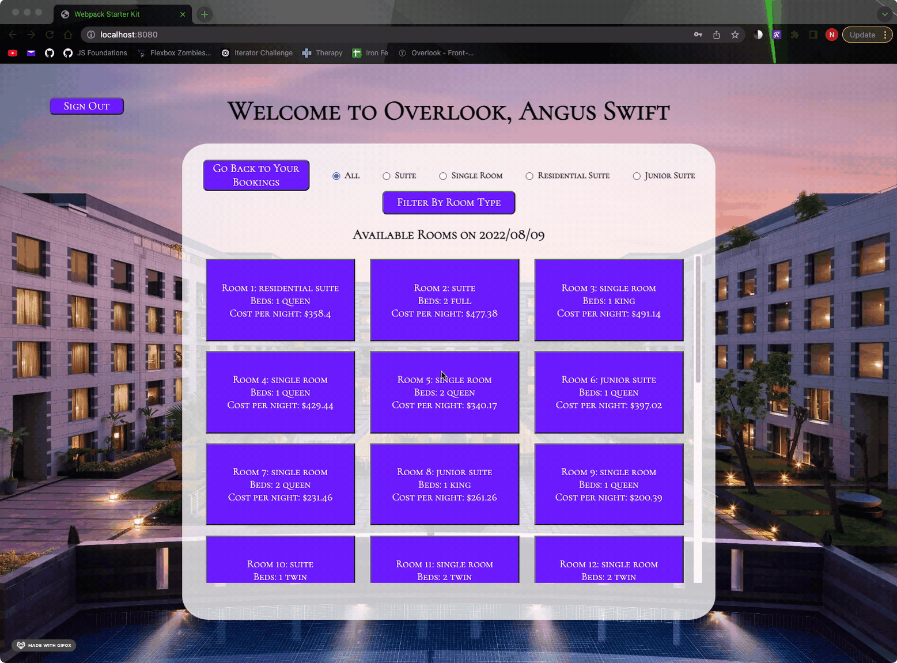
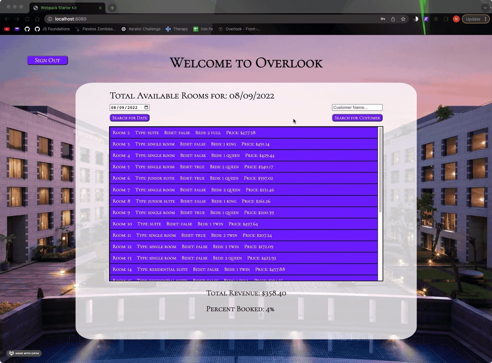
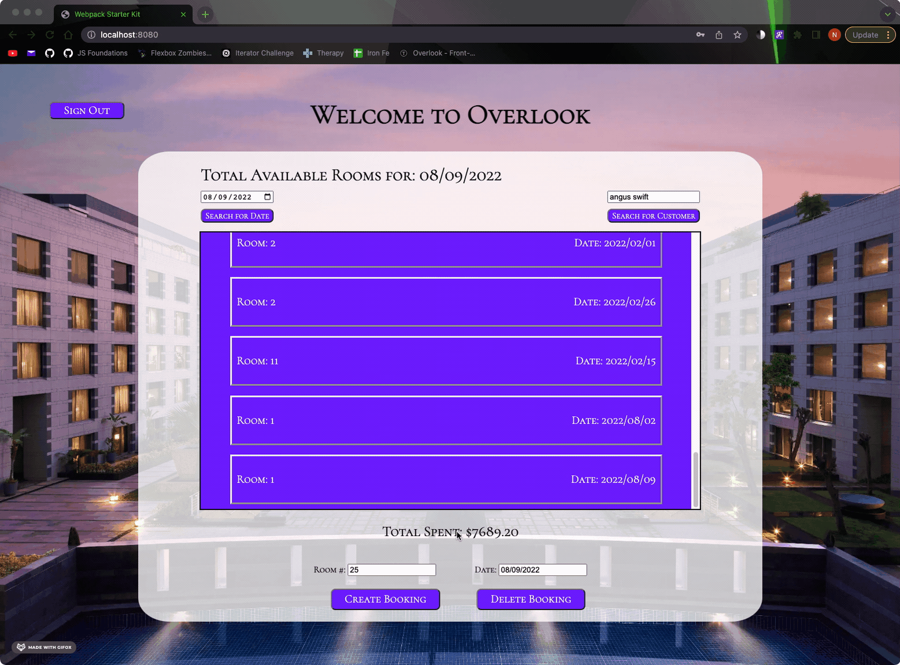

# Overlook Hotel

## Introduction

- This project simulates the functionality of a hotel website.
- If you login as a customer, you will see a list of room bookings for that particular customer. 
- The customer can search for future dates to see what rooms are available to book. A customer can select from a filtered list of available rooms, book one, and see their updated bookings list.
- If you login as a manager, you will see a list of available rooms, the total revenue, and the percentage booked for today's date.
- The manager can look back on previous dates to check the stats of past dates (i.e. How booked were we on Valentine's Day, Christmas, etc.). The manager can also look up customers by name and either add or delete future bookings for that user.

## Setup

- Clone down the Back End repository by running `git clone git@github.com:turingschool-examples/overlook-api.git`.
- `cd` into that repository and run `npm install`.
- Once the install is complete, run `npm start` to run the local server.
- Then clone down the Front End repository by running `git clone git@github.com:NickLiggett/Overlook.git`.
- `cd` into that repository and run `npm install`.
- Once the install is complete, run `npm start` to run the Application's User Interface.

## Application in Action

## Technologies Used
- Javascript
- HTML
- CSS
- VSCode
- Mocha / Chai
- Webpack
- Fetch API

## Possible Future Extensions
- Enhance the "Search for Customer by Name" input box to drop down possible customers as the input is filled.
- Upon the right-click of a customer's future booking, a manager will see an option to delete the booking.
- Add the ability for a customer to search for the availability of a particular room.
- Improve overall window reactivity to size changes.
- Utitlize the throwing and catching of Errors more efficiently.

## Sources
- [MDN](http://developer.mozilla.org/en-US/)
- [W3Schools](https://www.w3schools.com/)
- [StackOverflow](https://stackoverflow.com/)

## Contributors
  - [Nick Liggett](https://github.com/NickLiggett)
